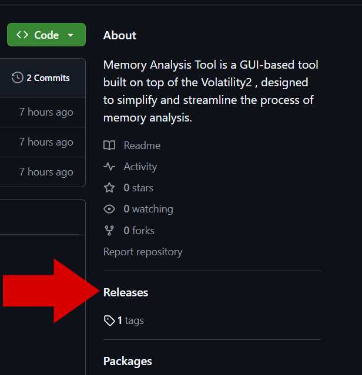
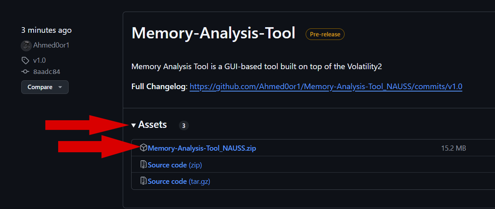
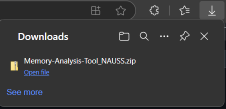
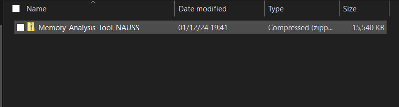
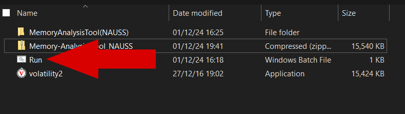
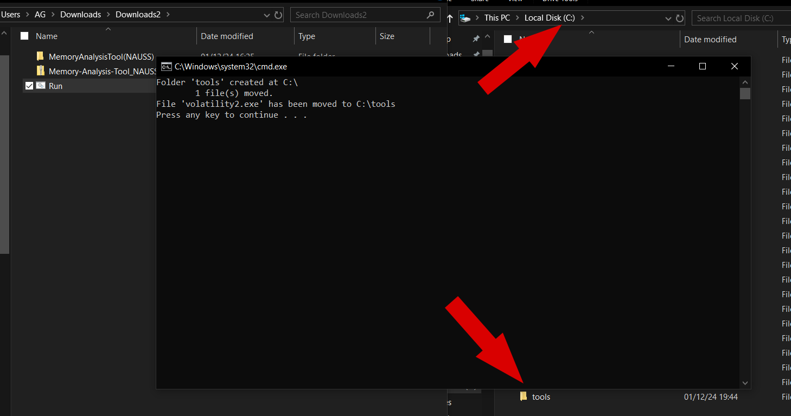
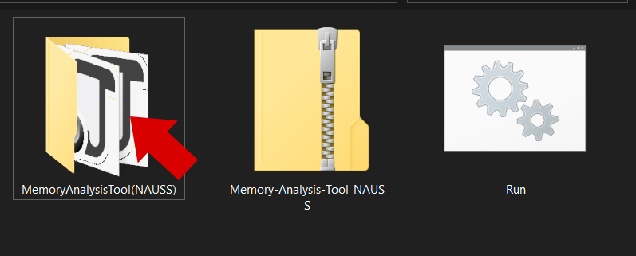
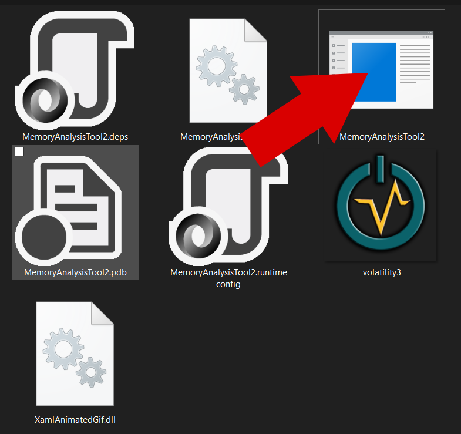
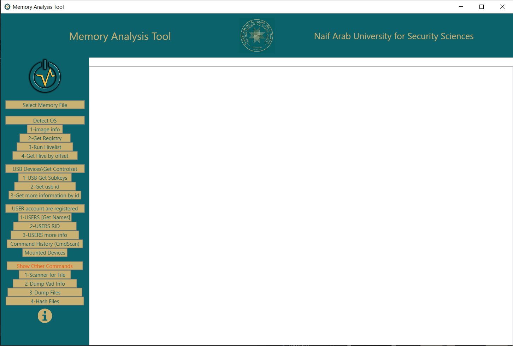

# install 
# 1-From the Releases option.



# 2-Download the compressed file from Assets.



# 3-After the download is complete.



# 4-Extract the compressed file.



# 5-Run the "Run.bat" file.



# 6-It creates a folder named tools in the ```C:\``` drive and moves the volatility2 file into it.



# 7-Open the program folder.



# 8-Run the specified program.



# 9-This opens the main interface of the program.




Enjoy😁 It’s simple and easy to use. Just from ```Select Memory File```, and from the left menu, pick the commands. If any variables are required, they will appear at the top👆.

Best regards! 👨‍💻


